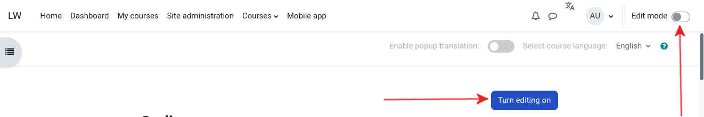
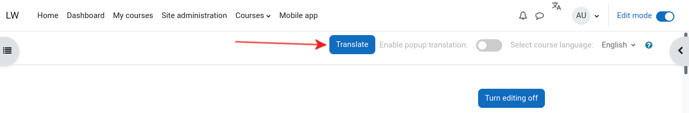

**Introduction**
================
This is a local **Moodle** plugin that is used to translate **Moodle** courses from English to Kinyarwanda.

**Manual installation**
=======================
1. Clone this repository
2. Unzip it in the ``/local`` directory of your Moodle installation
3. Install the [``moodle-courseselect``](https://github.com/Digital-Umuganda/moodle-courseselect) custom field
4. Install the [``boost_custom_translation``](https://github.com/Digital-Umuganda/boost_custom_translation) theme

**Usage guide**
===============
How to translate a course
=========================
1. First, turn on editing for the course

After turning editing on, you will notice a Translate button in the top navigation bar.

2. Click on the translate button

3. Choose the modules you want to translate

Then, click continue.
4. Assign a shortname to your course
 and click continue. Wait for the translation to finish. When the translation finshes, you will be automatically redirected to the new course.

Inline course text translation
==============================
1. Enable the widget by toggling the toggle in the navigation bar

2. Select the text you want to translate

After that, you will see a popup widget

**Requirements**
================
User requirements
=================
To translate a course, the user must have course editing capability in Moodle 

**How it works**
================
When you click the last ``continue`` button, the plugin first duplicates the current course and then it takes the text/html of the modules you chose and send them to the machine translation API. Upon receiving the translated text, it updates the database and replaces untranslated text with incoming data.

**Future works**
================
- Support other languages
- Support other machine translations

**Author**
==========
Developed by [Elvis Peace NDAHAYO RUGERO](https://github.com/nrep) and [Digital Umuganda](https://github.com/Digital-Umuganda) with the funding of [GIZ](https://www.giz.de) Fair Forward

**TODO**
========
- [ ] License
- [ ] Backend machine translation requirements